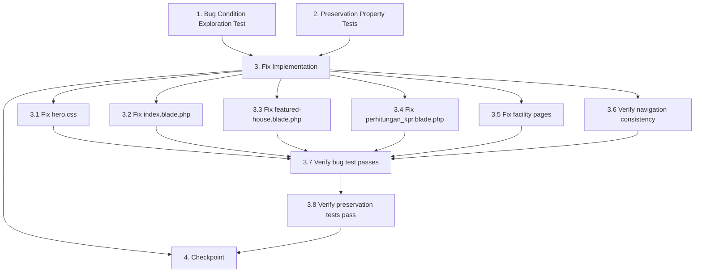

# Implementation Plan

## Overview
This implementation plan fixes responsive CSS issues in Casa Asraya where elements become cramped and layouts break on mobile and tablet viewports. The approach follows the bug condition methodology: first explore the bug with tests, write preservation tests for non-buggy behavior, then implement the fix with validation.

## Task Dependency Graph



**Dependency Notes:**
- Tasks 1 and 2 are independent and can run in parallel (both BEFORE fix)
- Task 3 (implementation) requires tasks 1 and 2 to be complete
- Sub-tasks 3.1-3.6 are independent and can be done in any order
- Task 3.7 requires all implementation sub-tasks (3.1-3.6) to be complete
- Task 3.8 requires task 3.7 to be complete
- Task 4 requires task 3.8 to be complete

```json
{
  "waves": [
    {
      "name": "Wave 1: Exploration and Preservation Testing",
      "tasks": ["1", "2"]
    },
    {
      "name": "Wave 2: Implementation",
      "tasks": ["3.1", "3.2", "3.3", "3.4", "3.5", "3.6"]
    },
    {
      "name": "Wave 3: Validation",
      "tasks": ["3.7", "3.8"]
    },
    {
      "name": "Wave 4: Checkpoint",
      "tasks": ["4"]
    }
  ]
}
```

---

## Tasks

### Phase 1: Exploration Testing (Before Fix)

- [x] 1. Write bug condition exploration test
  - **Property 1: Bug Condition** - Cramped Layout Detection on Mobile/Tablet Viewports
  - **CRITICAL**: This test MUST FAIL on unfixed code - failure confirms the bug exists
  - **DO NOT attempt to fix the test or the code when it fails**
  - **NOTE**: This test encodes the expected behavior - it will validate the fix when it passes after implementation
  - **GOAL**: Surface counterexamples that demonstrate cramped layouts and CSS crashes exist
  - **Scoped PBT Approach**: Scope property to concrete failing cases - specific viewport widths (375px, 414px, 768px) combined with specific elements (hero sections, bento grid, chapter overlays, unit cards)
  - Test that for viewports <768px, hero sections have horizontal padding ≥16px (from Bug Condition: `isBugCondition(viewport, "hero-sections")` where viewport <768)
  - Test that for viewports <768px, hero sections have top padding ≤100px (from Bug Condition: adequate but not excessive)
  - Test that bento grid collapses to single column at viewport ≤639px with no overlap (from Bug Condition: `isBugCondition(viewport, "bento-grid")` where viewport <768)
  - Test that chapter overlay CTA buttons don't overflow container at viewport ≥320px (from Bug Condition: `isBugCondition(viewport, "chapter-overlays")`)
  - Test that unit cards on tablet (768-991px) have adequate padding using clamp (from Bug Condition: `isBugCondition(viewport, "unit-cards-featured-house")`)
  - Test that facility icons scale down proportionally on mobile (from Bug Condition: `isBugCondition(viewport, "facility-icons")`)
  - Run test on UNFIXED code
  - **EXPECTED OUTCOME**: Test FAILS (this is correct - it proves the bug exists)
  - Document counterexamples found:
    - `hero-horizontal-padding` at 375px viewport yields <16px (e.g., 15px from `4vw = 15px`)
    - `bento-grid` at 700px viewport uses cramped 2-column layout instead of single column
    - `chapter-cta` buttons overflow at viewport <268px with fixed `width: 220px`
    - `facility-icon` uses fixed `70px` without scaling at 375px viewport
  - Mark task complete when test is written, run, and failures are documented
  - _Requirements: 1.1, 1.2, 1.3, 1.4, 1.5, 1.6, 1.7, 1.8, 1.9, 1.10_

---

### Phase 2: Preservation Testing (Before Fix)

- [x] 2. Write preservation property tests (BEFORE implementing fix)
  - **Property 2: Preservation** - Desktop Layout and Functionality Preservation
  - **IMPORTANT**: Follow observation-first methodology
  - Observe behavior on UNFIXED code for desktop viewports (>1200px) and non-buggy elements
  - Observe: Desktop hero sections at 1440px viewport display correctly with existing padding values
  - Observe: Bento grid at 1440px viewport uses multi-column layout correctly
  - Observe: Hover effects on `.unit-card`, `.ab-arrow-hover`, `.btn-explore`, `.btn-book` work correctly
  - Observe: Hero scroll animation with canvas frame-scrubbing works correctly
  - Observe: Navigation dropdown menus and mobile hamburger menu JavaScript (`openMobileMenu`, `closeMobileMenu`, `toggleSub`) function correctly
  - Observe: Form validation and `calculateKPR()` JavaScript in `perhitungan_kpr.blade.php` function correctly
  - Observe: Brand colors (#D4622A, #1a3a2e, #f5f1ea) and fonts (Outfit, IBM Plex) display consistently
  - Write property-based tests capturing observed behavior patterns from Preservation Requirements:
    - For all viewports ≥1200px, layout and spacing remain identical to original
    - For all viewports, JavaScript functionality (scroll scrubbing, KPR calculator, mobile menu) continues to work
    - For all viewports, hover effects and CSS transitions continue to work
    - For all viewports, brand colors and typography remain consistent
  - Property-based testing generates many test cases for stronger guarantees
  - Run tests on UNFIXED code
  - **EXPECTED OUTCOME**: Tests PASS (this confirms baseline behavior to preserve)
  - Mark task complete when tests are written, run, and passing on unfixed code
  - _Requirements: 3.1, 3.2, 3.3, 3.4, 3.5, 3.6, 3.7, 3.8, 3.9, 3.10_

---

### Phase 3: Implementation

- [x] 3. Fix responsive CSS issues across all affected pages

  - [x] 3.1 Fix hero.css responsive issues
    - Fix chapter CTA button sizing: change from `width: 220px` to `width: min(220px, calc(100vw - 48px)); max-width: 100%` to prevent overflow on viewports <268px
    - Add media query for very small screens (<360px): reduce chapter overlay padding from `0 24px` to `0 16px`
    - Ensure `.hero-chapter` responsive padding works correctly across all mobile breakpoints
    - _Bug_Condition: isBugCondition(viewport, "chapter-overlays") where viewport < 768_
    - _Expected_Behavior: Chapter overlay CTA buttons don't overflow and have adequate padding (≥16px horizontal) at all viewports ≥320px_
    - _Preservation: Desktop hero layout (>1200px) and hero scroll animation remain unchanged_
    - _Requirements: 1.4, 2.4, 3.1, 3.2_

  - [x] 3.2 Fix index.blade.php responsive issues
    - Fix bento grid breakpoint gap: change media query from `max-width: 639px` to `max-width: 767px` for single-column collapse
    - Ensure `.ab-bento-grid` uses `grid-template-columns: 1fr` on mobile without overlap
    - Validate `.ab-bottom` grid collapse to single column with adequate spacing
    - Add media query for `.facility-icon`: use `width: clamp(50px, 12vw, 70px); height: clamp(50px, 12vw, 70px)` on mobile
    - Fix `.facility-wrapper` padding-top: change from `padding-top: 15%` to `padding-top: clamp(32px, 10vh, 80px)`
    - _Bug_Condition: isBugCondition(viewport, "bento-grid") where viewport < 768, and isBugCondition(viewport, "facility-icons") where viewport < 768_
    - _Expected_Behavior: Bento grid collapses to single column at viewport ≤767px with no overlap; facility icons scale proportionally on mobile_
    - _Preservation: Desktop bento grid layout and facility section remain unchanged_
    - _Requirements: 1.3, 1.9, 1.10, 2.3, 2.9, 2.10, 3.1_

  - [x] 3.3 Fix featured-house.blade.php responsive issues
    - Fix `.unit-info` padding: change from `padding: 32px` to `padding: clamp(20px, 4vw, 32px)` for better tablet scaling
    - Fix hero section top padding: change from `padding: 140px clamp(16px,4vw,48px) 80px` to `padding: clamp(80px, 18vw, 140px) clamp(16px,4vw,48px) clamp(40px,6vw,80px)`
    - Ensure card spacing uses adequate gap values (≥20px) on tablet viewports
    - _Bug_Condition: isBugCondition(viewport, "unit-cards-featured-house") where viewport >= 768 AND viewport <= 991_
    - _Expected_Behavior: Unit cards have adequate padding and spacing on tablet; hero top padding scales appropriately on mobile_
    - _Preservation: Desktop unit card layout and hover effects remain unchanged_
    - _Requirements: 1.1, 1.5, 2.1, 2.5, 3.1, 3.3_

  - [x] 3.4 Fix perhitungan_kpr.blade.php responsive issues
    - Ensure form stacks vertically with adequate spacing on mobile (already uses `col-lg-6`)
    - Add media query to ensure `.kpr-input` has `padding: 14px 16px` on mobile for touch-friendly targets
    - Verify form card padding using `clamp(20px, 4vw, 48px)` works correctly
    - Fix hero section top padding: use `clamp(80px, 18vw, 140px)` for top padding
    - _Bug_Condition: isBugCondition(viewport, "kpr-form") where viewport < 768_
    - _Expected_Behavior: Form inputs stack vertically with adequate spacing (gap ≥20px) and touch-friendly padding (≥12px vertical)_
    - _Preservation: Form validation and calculateKPR() JavaScript functionality remain unchanged_
    - _Requirements: 1.1, 1.6, 2.1, 2.6, 3.1, 3.7_

  - [x] 3.5 Fix facility pages responsive issues (spool.blade.php, gym.blade.php, clubhouse.blade.php, etc.)
    - Fix hero top padding: change from `padding: 140px clamp(16px,4vw,48px) 64px` to `padding: clamp(80px,18vw,140px) clamp(16px,4vw,48px) clamp(40px,6vw,64px)`
    - Ensure clamp() horizontal padding minimum is adequate (≥16px) across all breakpoints
    - Verify responsive scaling works smoothly across all facility pages
    - _Bug_Condition: isBugCondition(viewport, "hero-sections") where viewport < 768_
    - _Expected_Behavior: Hero sections have adequate horizontal padding (≥16px) and appropriate top padding (≤100px on mobile)_
    - _Preservation: Desktop hero layout and facility content remain unchanged_
    - _Requirements: 1.1, 1.2, 2.1, 2.2, 3.1_

  - [x] 3.6 Verify navigation and global CSS consistency
    - Ensure navigation bar padding uses consistent clamp() values across all pages
    - Verify mobile menu toggle and dropdown functionality remain unchanged
    - Check that CSS custom properties are used consistently where applicable
    - _Bug_Condition: isBugCondition(viewport, "navigation-bar") where viewport < 768_
    - _Expected_Behavior: Navigation spacing and padding are consistent across all breakpoints_
    - _Preservation: Navigation functionality, dropdown menus, and mobile hamburger menu remain unchanged_
    - _Requirements: 1.7, 2.7, 3.5_

  - [x] 3.7 Verify bug condition exploration test now passes
    - **Property 1: Expected Behavior** - Cramped Layout Detection on Mobile/Tablet Viewports
    - **IMPORTANT**: Re-run the SAME test from task 1 - do NOT write a new test
    - The test from task 1 encodes the expected behavior
    - When this test passes, it confirms the expected behavior is satisfied
    - Run bug condition exploration test from step 1
    - **EXPECTED OUTCOME**: Test PASSES (confirms bug is fixed)
    - Verify all assertions pass:
      - Hero sections have horizontal padding ≥16px at viewport 375px
      - Hero sections have top padding ≤100px at viewport 375px
      - Bento grid collapses to single column at viewport ≤767px with no overlap
      - Chapter overlay CTA buttons don't overflow at viewport 320px
      - Unit cards have adequate padding using clamp at viewport 768-991px
      - Facility icons scale proportionally at viewport 375px
    - _Requirements: 2.1, 2.2, 2.3, 2.4, 2.5, 2.6, 2.7, 2.8, 2.9, 2.10_

  - [x] 3.8 Verify preservation tests still pass
    - **Property 2: Preservation** - Desktop Layout and Functionality Preservation
    - **IMPORTANT**: Re-run the SAME tests from task 2 - do NOT write new tests
    - Run preservation property tests from step 2
    - **EXPECTED OUTCOME**: Tests PASS (confirms no regressions)
    - Verify all preservation assertions pass:
      - Desktop layout (>1200px) remains identical to original
      - Hero scroll animation continues to work
      - Hover effects and CSS transitions continue to work
      - JavaScript functionality (KPR calculator, mobile menu) continues to work
      - Brand colors and typography remain consistent
    - Confirm all tests still pass after fix (no regressions)
    - _Requirements: 3.1, 3.2, 3.3, 3.4, 3.5, 3.6, 3.7, 3.8, 3.9, 3.10_

---

### Phase 4: Checkpoint

- [x] 4. Checkpoint - Ensure all tests pass
  - Run complete test suite (bug condition + preservation tests)
  - Verify no horizontal overflow on any page at viewports 320px, 375px, 414px, 768px, 1024px, 1440px
  - Verify desktop layout unchanged at viewports ≥1200px
  - Verify all JavaScript functionality works correctly (scroll scrubbing, KPR calculator, mobile menu)
  - Verify all hover effects and CSS transitions work correctly
  - Document any issues that arise and ask user if questions come up
  - Mark complete when all tests pass and no regressions are detected

---

## Notes

- **Bug Condition Methodology**: This plan uses C(X) to identify buggy inputs (mobile/tablet viewports with cramped elements), P(result) for expected behavior (adequate spacing), ¬C(X) for non-buggy inputs (desktop viewports), F for original function, and F' for fixed function
- **Testing Approach**: Exploration tests validate the bug exists before fixing; preservation tests ensure desktop behavior remains unchanged; both are re-run after implementation
- **Property-Based Testing**: Recommended for preservation tests to generate many test cases automatically and provide stronger guarantees across viewport ranges
- **Visual Regression**: Consider using browser DevTools device emulation or automated visual regression tools (e.g., Percy, BackstopJS) for comprehensive testing
